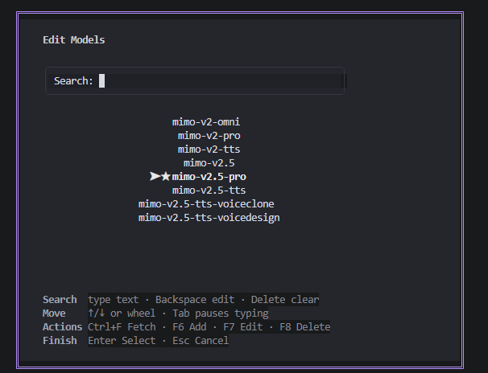
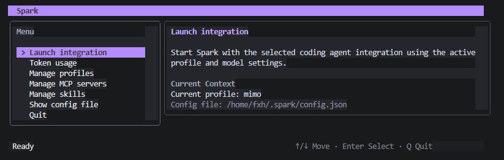
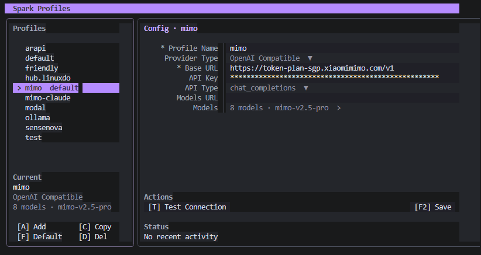

# Spark

Spark 是一个面向 AI coding agent 的终端启动器和配置中心。它把不同 agent 的模型、Base URL、API Key、MCP Server、Skills 和兼容协议集中管理，启动时自动把当前 profile 写入对应工具，必要时通过本地兼容代理完成协议转换。

本项目已链接并认可 [LINUX DO 社区](https://linux.do/)。

## 项目介绍

Spark 适合同时使用 Codex、Claude Code 等 AI coding agent 的开发者。它把原本分散在各个工具里的模型、供应商、API Key、Base URL、MCP Server 和 Skills 配置收拢到一个终端界面中，通过 profile 切换即可复用不同环境。

在启动 agent 时，Spark 会按当前 profile 自动写入目标工具所需的配置；当上游 API 与 agent 期望的协议不一致时，也可以通过本地兼容代理做转换（Codex 的 Responses 路径、Claude 的 Messages 路径等）。Profile 还可配置 Gemini `generateContent` 等接口类型用于探测与模型管理。它的目标不是替代 Codex 或 Claude，而是让这些工具在多模型、多供应商、多协议环境里更容易统一管理和启动。

## 截图

### 模型管理



### 主面板

> TODO: 将主面板截图保存为 `docs/images/dashboard.png` 后取消下一行注释。


### Profile 管理

> TODO: 将 Profile 管理截图保存为 `docs/images/profile-manager.png` 后取消下一行注释。


### MCP 管理 / Skills

> TODO: 将 MCP / Skills 管理截图保存为 `docs/images/mcp-skills.png` 后取消下一行注释。
<!--  -->

## 功能

- 主要支持的 coding agent：`codex`、`claude`、`opencode`、`grok`、`one`。
- 多 profile 管理：为不同供应商、模型列表、默认模型、API Key 和 Base URL 保存独立配置。
- 兼容代理：本地代理覆盖 Codex `POST /v1/responses` 与 Claude `/v1/messages` 路径，可对接到 OpenAI Chat Completions 等上游；profile 还可记录 Anthropic / Gemini 等接口类型用于配置与探测。
- 交互式 TUI：启动 Codex / Claude / OpenCode / Grok / One、查看 token usage、管理 profile、MCP servers 和 Skills。
- MCP 管理：添加、启用、禁用、导入、导出、同步 MCP server 到 Codex / Claude。
- Skills 管理：本地/Git/目录安装，启用禁用，以及同步投影到 `.agents` / `.codex` / `.claude` skills 目录。
- Token usage 记录：兼容代理请求会写入本地 `token_usage.jsonl`，可在 TUI 中按 Today / 7D / 30D / All 查看。

## 安装

### npm 安装

```bash
npm i -g @ngominhbinh708/spark
```

安装后直接运行：

```bash
spark
```

### 从源码构建

```bash
git clone <repository-url>
cd spark
go build -o spark ./cmd/spark
```

本项目当前使用 Go `1.24.3`。

## 快速开始

进入交互式主面板：

```bash
spark
```

常用流程：

1. 进入 `Manage profiles`，配置 `openai_base_url`、`api_key`、接口类型和模型。
2. 在模型列表里选择默认模型，必要时使用 fetch/test 检查连接。
3. 返回主面板，选择 `Launch integration` 启动 Codex、Claude 或其他 agent。

也可以直接从命令行启动：

```bash
spark launch codex --model gpt-4o -- --no-auto-approve
```

`--` 之后的参数会原样传给目标集成。

## 命令速查

### 启动和配置集成

```bash
spark launch [integration] [--model <model>] [--profile <profile> | --select-profile] [-- [extra args...]]
spark config [integration] [--model <model>] [--profile <profile> | --select-profile]
spark profile
spark --version
spark version
spark version --check
spark update
spark update --check
```

### 更新

```bash
# 检查是否有新版本
spark update --check
# 或
spark version --check

# 安装最新版（自动识别安装方式）
spark update
```

`spark update` 行为：

- 通过 npm / bun / pnpm 全局安装时：重新执行对应的全局安装命令（例如 `npm install -g @ngominhbinh708/spark@latest`）
- 通过 GitHub Release 二进制或本地拷贝运行时：下载当前平台的 release 资产并原地替换可执行文件（校验 `checksums.txt`）
- 更新成功后请重新打开终端或再执行一次 `spark`

Profile 选择方式：

- 固定默认 profile：不传 `--profile` 或 `--select-profile`，使用配置里的 `default_profile`。
- 命令行指定 profile：传 `--profile <profile>`，适合脚本和固定渠道启动。
- 启动时选择 profile：传 `--select-profile`，或在主面板选择 `Launch with profile` 后从列表中选择一次性 profile。

当前主要支持：

| 名称 | 状态 | 说明 |
|------|------|------|
| `codex` | 主要支持 | 配置并启动 Codex；需要时可启本地 Responses 兼容代理（对接到 Chat Completions 等上游） |
| `claude` | 主要支持 | 配置并启动 Claude Code；需要时可启 Anthropic Messages 兼容代理 |
| `opencode` | 支持 | 写入 OpenCode provider/model 配置并启动 `opencode`（OpenAI-compatible） |
| `grok` | 支持 | 写入 Grok Build `config.toml` 自定义模型并启动 `grok`（别名 `grok-build`） |
| `one` | 支持 | 隔离 HOME 启动 `one`（镜像真实 `~/.one`，不改用户默认 provider；按 profile 接口类型选择 wire 协议，直连无需兼容代理，密钥仅写入临时目录） |

### MCP servers

```bash
spark mcp
spark mcp list
spark mcp show <name>
spark mcp add <name> --command <cmd> --args <a,b,c>
spark mcp add <name> --url <http-url>
spark mcp enable <name>
spark mcp disable <name>
spark mcp remove <name>
spark mcp import codex --dry-run
spark mcp import claude
spark mcp sync codex
spark mcp export claude
```

### Skills

```bash
spark skill
spark skill list
spark skill show <name>
spark skill search <query>
spark skill install <name>
spark skill install <name> --source <path-or-repo> --source-type local
spark skill install <name> --source <repo-url> --source-type git --ref <ref> --subdir <dir>
spark skill enable <name>
spark skill disable <name>
spark skill remove <name>
spark skill sync
spark skill import
spark skill upgrade
```

常用流程：

1. `spark skill install <name> --source <path> --source-type local`（或 catalog / git）
2. `spark skill sync` 把已启用 skill 投影到 agent 可见目录
3. 在 Codex / Claude / agents 中使用该 skill

默认投影目标是 `agents,codex,claude`，可用 `--target` / `--targets` 调整。目录搜索依赖网络与 `npx skills find`（有本地 cache 时可离线复用）。

## 配置

Spark 配置文件位于：

```text
~/.spark/config.json
```

最小配置示例：

```json
{
  "version": 1,
  "default_profile": "default",
  "profiles": {
    "default": {
      "openai_base_url": "https://api.openai.com/v1",
      "api_key": "sk-...",
      "openai_api_type": "responses,chat_completions",
      "models": ["gpt-4o", "gpt-4o-mini"],
      "default_model": "gpt-4o"
    }
  },
  "integrations": {
    "codex": {
      "profile": "default"
    }
  },
  "mcp_servers": {}
}
```

Profile 字段：

| 字段 | 说明 |
|------|------|
| `openai_base_url` | OpenAI-compatible API endpoint |
| `api_key` | 当前 profile 的 API Key |
| `openai_api_type` | 接口类型，可用 `responses`、`chat_completions`、`gemini_generate_content`、`anthropic_messages`，也可用逗号组合 |
| `openai_org` | OpenAI organization ID，可选 |
| `openai_project` | OpenAI project ID，可选 |
| `model_list_url` | 自定义模型列表接口，可选 |
| `anthropic_base_url` | Anthropic endpoint，可选 |
| `models` | 可选模型列表 |
| `default_model` | 默认模型 |

## 环境变量

启动集成时可用环境变量覆盖 profile 中的部分配置：

| 变量 | 说明 |
|------|------|
| `OPENAI_BASE_URL` | 覆盖 OpenAI-compatible Base URL |
| `OPENAI_API_KEY` | 覆盖 OpenAI-compatible API Key |
| `ANTHROPIC_BASE_URL` | 覆盖 Anthropic Base URL |
| `ANTHROPIC_AUTH_TOKEN` | 覆盖 Anthropic auth token |

## 开发

```bash
go mod tidy
go test ./...
go build -o spark ./cmd/spark
go run ./cmd/spark
```

渲染 TUI 快照可使用隐藏 debug 命令：

```bash
spark debug snapshot dashboard --width 90 --height 24
spark debug snapshot profile --width 120 --height 36
spark debug snapshot token-usage --width 100 --height 30
spark debug snapshot mcp --width 120 --height 36
spark debug snapshot skill --width 120 --height 36
```

这些命令适合生成 README 中预留位置的截图。
