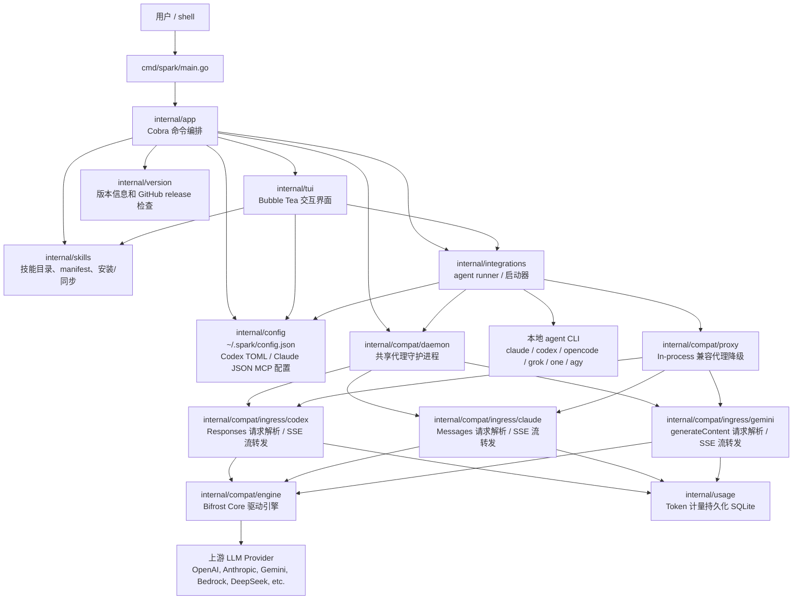

# internal 技术架构说明

本文梳理 `internal/` 下各包职责、主要文件用途和运行时调用关系。当前项目是一个 Go CLI：`cmd/spark/main.go` 只负责启动 `app.NewRootCmd()`，业务逻辑都在 `internal/`。

## 总体架构图

## 包职责

| 包 | 主要职责 | 关键文件 |
| --- | --- | --- |
| `internal/app` | CLI 命令层。定义 `spark` 根命令、`launch/daemon/config/mcp/skill/profile/debug/version/usage` 等子命令，连接 TUI、配置、集成和技能模块。 | `cli.go`, `daemon_cmd.go`, `mcp_cmd.go`, `skill_cmd.go`, `version.go` |
| `internal/config` | Spark 自身配置模型和持久化；管理 profiles、integrations、MCP servers；读写 Codex TOML 和 Claude JSON。 | `config.go`, `mcp.go`, `toml.go`, `claude_json.go`, `files.go` |
| `internal/integrations` | 各 agent 的启动/配置适配层。把 profile/model 写入目标 agent 配置或环境变量，优先连接共享 daemon，回退到 in-process 代理；AGY 在 `gemini_generate_content` Profile 上直连，否则走 Gemini generateContent 兼容入口。正式注册：`agy` / `claude` / `codex` / `opencode` / `grok` / `one`。 | `registry.go`, `types.go`, `agy.go`, `claude.go`, `codex.go`, `opencode.go`, `grok.go`, `one.go`, `compatio.go` |
| `internal/compat/engine` | Bifrost Core 核心驱动引擎与插件管理。封装 `github.com/maximhq/bifrost/core` 单例、Profile 到 Provider 映射、动态 API Key 绑定与 Spark LLM 插件。 | `bifrost.go`, `profile.go`, `plugin.go` |
| `internal/compat/ingress/codex` | Codex Ingress 适配。将 Codex `POST /v1/responses` 转换为 `schemas.BifrostChatRequest`，并将 Bifrost 响应流转换为 Codex Responses SSE 事件。 | `handler.go`, `request.go`, `stream.go` |
| `internal/compat/ingress/claude` | Claude Ingress 适配。将 Anthropic `POST /v1/messages` 转换为 `schemas.BifrostChatRequest`，并将 Bifrost 响应流转换为 Anthropic Messages SSE 事件。 | `handler.go`, `request.go`, `stream.go` |
| `internal/compat/ingress/gemini` | Gemini Ingress 适配。将 `POST /v1beta/models/{model}:generateContent` / `streamGenerateContent` 转换为 `schemas.BifrostChatRequest`，并将 Bifrost 响应流转换为 Gemini SSE 事件。 | `handler.go`, `request.go`, `stream.go`, `response.go` |
| `internal/compat/daemon` | 共享 background daemon 服务（默认监听 `127.0.0.1:42337`）。支持多客户端并发接入、连接池复用与动态 profile 路由。 | `daemon.go`, `client.go` |
| `internal/compat/proxy` | In-process 兼容代理运行时（监听随机端口）。在不启用 daemon 时作为降级方案。 | `server.go`, `codex_compat_proxy.go`, `claude_compat_proxy.go`, `gemini_compat_proxy.go` |
| `internal/compat/proxyutil` | 代理流式 HTTP client、日志脱敏与滚动日志工具。 | `compatio.go` |
| `internal/usage` | Token 消耗 SQLite 记录与统计。提供今日/7天/30天/全量窗口聚合查询与模型/Client 过滤。 | `store.go`, `query.go` |
| `internal/skills` | 本地技能系统。管理技能根目录、registry、manifest、安装、同伴 agent 技能导入/导出。 | `types.go`, `roots.go`, `registry.go`, `manifest.go`, `install.go`, `catalog.go`, `peer.go`, `files.go` |
| `internal/tui` | 终端交互 UI。提供选择、输入、确认、dashboard、profile/MCP/skill 管理界面和模型连通性测试 UI。 | `prompt.go`, `dashboard_*`, `profile_manager_*`, `mcp_manager_*.go`, `skill_manager_model.go`, `nav_back.go`, `model_connection.go` |
| `internal/version` | 版本元信息、缓存和更新检查。 | `version.go` |

## LLM API 转换逻辑

1. **Codex CLI 路径**：
   `Codex CLI` -> `POST /v1/responses` -> `ingress/codex` -> 转为 `schemas.BifrostChatRequest` -> `Bifrost Core` -> 上游 Provider -> 流式响应由 `ingress/codex.ForwardStream` 写回 Codex SSE -> 记录 Usage 至 SQLite。

2. **Claude Code 路径**：
   `Claude Code` -> `POST /v1/messages` -> `ingress/claude` -> 转为 `schemas.BifrostChatRequest` -> `Bifrost Core` -> 上游 Provider -> 流式响应由 `ingress/claude.ForwardStream` 写回 Anthropic SSE -> 记录 Usage 至 SQLite。

3. **AGY 路径**：
   `AGY` 在 Gemini `generateContent` Profile 上直连；否则 `POST /v1beta/models/{model}:streamGenerateContent` -> `ingress/gemini` -> 转为 `schemas.BifrostChatRequest` -> `Bifrost Core` -> 上游 Provider -> 流式响应由 `ingress/gemini.ForwardStream` 写回 Gemini SSE -> 记录 Usage 至 SQLite。
