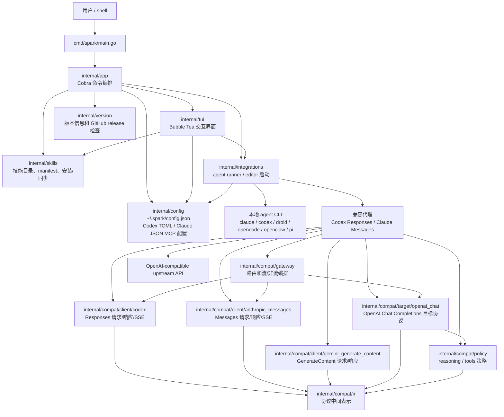
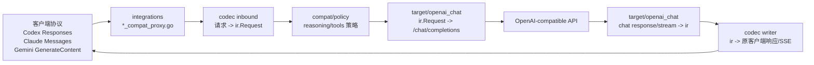
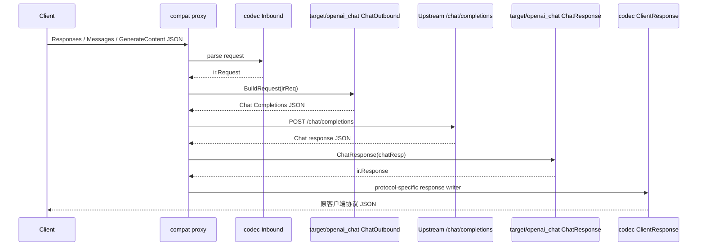
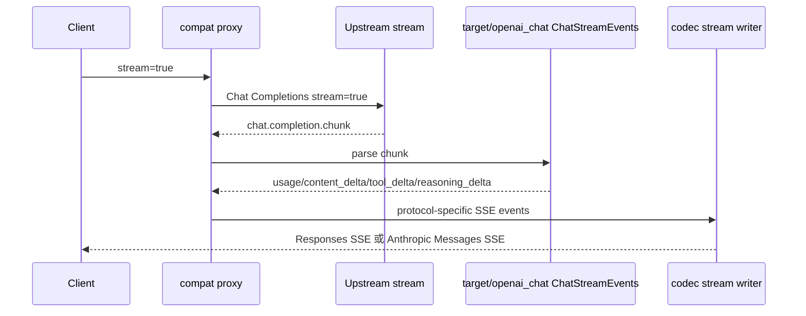
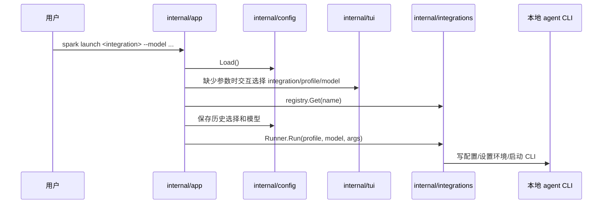
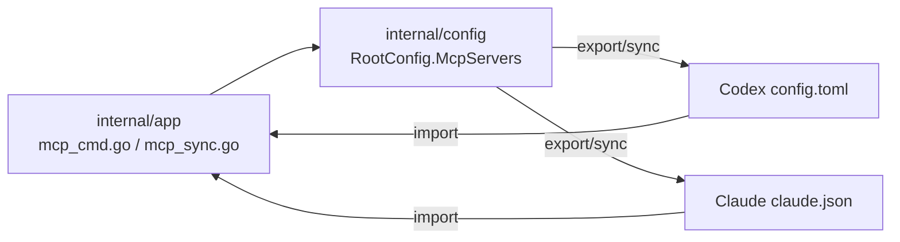
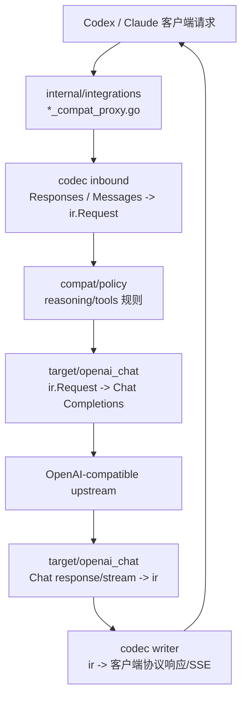

# internal 技术架构说明

本文梳理 `internal/` 下各包职责、主要文件用途和运行时调用关系。当前项目是一个 Go CLI：`cmd/spark/main.go` 只负责启动 `app.NewRootCmd()`，真实业务都在 `internal/`。

## 总体架构图



## 包职责

| 包 | 主要职责 | 关键文件 |
| --- | --- | --- |
| `internal/app` | CLI 命令层。定义 `spark` 根命令、`launch/config/mcp/skill/profile/debug/version` 等子命令，连接 TUI、配置、集成和技能模块。 | `cli.go`, `mcp_cmd.go`, `mcp_sync.go`, `skill_cmd.go`, `version.go` |
| `internal/config` | Spark 自身配置模型和持久化；管理 profiles、integrations、MCP servers；读写 Codex TOML 和 Claude JSON；从旧配置迁移。 | `config.go`, `mcp.go`, `toml.go`, `claude_json.go`, `files.go`, `migrate.go` |
| `internal/integrations` | 各 agent 的启动/配置适配层。把 profile/model 写入目标 agent 配置或环境变量，必要时启动本地兼容代理。 | `registry.go`, `types.go`, `claude.go`, `codex.go`, `droid.go`, `opencode.go`, `openclaw.go`, `pi.go`, `*_compat_*.go` |
| `internal/compat/ir` | 协议中间表示（IR）。抽象 Request、Message、ContentBlock、ReasoningBlock、ToolCall、ToolResult、Response、StreamEvent、Usage。 | `model.go`, `stream.go`, `usage.go` |
| `internal/compat/client/codex` | OpenAI Responses caller 协议适配。把 Responses 请求转 IR，或把 IR/Chat 结果写回 Responses 客户端格式和 SSE。 | `request_in.go`, `response_out.go`, `stream_out.go` |
| `internal/compat/client/anthropic_messages` | Anthropic Messages caller 协议适配。把 Messages 请求转 IR，或把结果写回 Anthropic Messages 响应和 SSE。 | `messages_inbound.go`, `messages_client_writer.go`, `messages_stream_writer.go` |
| `internal/compat/client/gemini_generate_content` | Gemini GenerateContent caller 协议适配。当前覆盖请求入站和客户端响应写出。 | `generate_content_inbound.go`, `generate_content_client_writer.go` |
| `internal/compat/target/openai_chat` | OpenAI Chat Completions target 协议适配。把 IR 转 Chat 请求，并把 Chat 响应/流转换回 IR 事件。 | `request_out.go`, `response_in.go`, `stream_in.go` |
| `internal/compat/gateway` | 兼容网关编排层。负责 route selection、HTTP handler、上游执行、stream/non-stream 转发和 gateway-level errors。 | `route.go`, `pipeline.go`, `codex_handler.go`, `stream.go`, `nonstream.go` |
| `internal/compat/policy` | 协议转换策略。处理 reasoning 可见性/归一化、tool call/tool result 兼容规则。 | `reasoning.go`, `tools.go` |
| `internal/skills` | 本地技能系统。管理技能根目录、registry、manifest、安装、同伴 agent 技能导入/导出。 | `types.go`, `roots.go`, `registry.go`, `manifest.go`, `install.go`, `catalog.go`, `peer.go`, `files.go` |
| `internal/tui` | 终端交互 UI。提供选择、输入、确认、dashboard、profile/MCP/skill 管理界面和模型连通性探测 UI。 | `prompt.go`, `dashboard_*`, `profile_manager_*`, `mcp_manager_*`, `skill_manager_model.go`, `model_connection.go` |
| `internal/version` | 版本元信息、缓存和更新检查。 | `version.go` |

## LLM API 转换逻辑

这部分是 `internal/` 里最核心的协议层：Spark 让不同 agent 继续以自己熟悉的 API 形态发请求，但内部统一转成一个中间表示，再打到 OpenAI-compatible Chat Completions 上游。



### 转换边界

| 阶段 | 代码位置 | 输入 | 输出 | 责任 |
| --- | --- | --- | --- | --- |
| HTTP 入口 | `internal/integrations/*_compat_proxy.go` | Codex/Claude 发来的 HTTP 请求 | 原始 `map[string]any` 请求或上游响应流 | 路由、日志、错误处理、fallback/retry、转发非转换请求 |
| 入站 client | `internal/compat/client/codex/request_in.go` | OpenAI Responses 请求 | `ir.Request` | 解析 `input/tools/tool_choice/max_output_tokens/stream`，补默认 user 消息 |
| 入站 client | `internal/compat/client/anthropic_messages/messages_inbound.go` | Anthropic Messages 请求 | `ir.Request` | 解析 `system/messages/content/tool_use/tool_result/thinking/max_tokens` |
| 入站 client | `internal/compat/client/gemini_generate_content/generate_content_inbound.go` | Gemini GenerateContent 请求 | `ir.Request` | 解析 `contents/parts/functionCall/functionResponse/inlineData/generationConfig` |
| 中间表示 | `internal/compat/ir` | 各协议结构 | `Request/Message/ContentBlock/ToolCall/ToolResult/Response/StreamEvent/Usage` | 把文本、reasoning、工具调用、工具结果、图片、文档统一成稳定模型 |
| 策略层 | `internal/compat/policy` | `ir` blocks | 规范化后的 blocks/config | 控制 reasoning 是否保留、tool call/tool result 怎么兼容 |
| 上游请求 | `internal/compat/target/openai_chat/request_out.go` | `ir.Request` | OpenAI Chat Completions 请求 | 映射 role、messages、tools、tool_choice、generation 参数 |
| 上游响应 | `internal/compat/target/openai_chat/response_in.go` | Chat Completions 非流式响应 | `ir.Response` | 提取 assistant text、reasoning、tool_calls、usage、stop reason |
| 上游流 | `internal/compat/target/openai_chat/stream_in.go` | Chat Completions chunk | `[]ir.StreamEvent` | 把 delta 拆成 text/reasoning/tool_call/usage 事件 |
| 出站 writer | `internal/compat/client/codex/*writer.go` | `ir.Response` 或 stream events | Responses JSON/SSE | 写 `response.created`、reasoning item、message item、tool_call item、usage、completed |
| 出站 writer | `internal/compat/client/anthropic_messages/*writer.go` | `ir.Response` 或 stream events | Messages JSON/SSE | 写 `message_start`、`content_block_*`、`message_delta`、`message_stop` |
| 出站 writer | `internal/compat/client/gemini_generate_content/*writer.go` | `ir.Response` | GenerateContent JSON | 写 `candidates/content/parts/usageMetadata` |

### 非流式路径



### 流式路径



流式转换不是简单转发字符串。`target/openai_chat.ChatStreamEvents` 先把上游 chunk 解析成 `ir.StreamEvent`，再由具体 writer 决定事件序列。Responses 会输出 `response.created -> item/delta events -> response.completed`；Anthropic 会输出 `message_start -> content_block_* -> message_delta -> message_stop`。

### 关键字段映射

| 语义 | Responses | Anthropic Messages | Gemini | ir | OpenAI Chat upstream |
| --- | --- | --- | --- | --- | --- |
| 输入文本 | `input[].content[].text` / string input | `messages[].content[].text` | `contents[].parts[].text` | `ContentBlock{Type: text}` | `messages[].content` |
| reasoning | `reasoning` item / summary | `thinking` / `reasoning` block | thought part | `ContentBlock{Type: reasoning}` | `reasoning_content` 或兼容字段 |
| 工具定义 | `tools` | `tools` | `tools.functionDeclarations` | `[]Tool` | `tools` |
| 工具选择 | `tool_choice` | `tool_choice` | generation/tool config | `ToolChoice` | `tool_choice` |
| 工具调用 | function call item | `tool_use` | `functionCall` | `ToolCall` | `assistant.tool_calls` |
| 工具结果 | function call output | `tool_result` | `functionResponse` | `ToolResult` | `tool` role message |
| 最大 token | `max_output_tokens` | `max_tokens` | `generationConfig.maxOutputTokens` | `Generation.MaxTokens` | `max_tokens` |
| usage | `usage` | `usage` | `usageMetadata` | `Usage` | `usage` |
| stop reason | `status/details` | `stop_reason` | `finishReason` | `StopReason` | `finish_reason` |

### 兼容代理中的旧/新边界

`internal/integrations` 仍保留一部分老的兼容抽象：

- `compat_translators.go`: `responsesRequestTranslator` / `anthropicRequestTranslator` 调用新 codec，再用 `target/openai_chat.ChatOutbound` 生成 Chat 请求。
- `compat_executors.go`: `codexChatExecutor` / `anthropicChatExecutor` 负责请求上游和 provider-specific retry。
- `compat_pipeline.go`: `executeTranslatedChat` 串起 translator 和 executor。
- `compat_writers.go`: 把上游 Chat response 先转 `ir.Response`，再调用 Anthropic writer。

新协议转换代码已经主要落在 `internal/compat/ir` 和 `internal/compat/*`；`integrations` 更像 HTTP 代理和 agent 启动层。

## 关键运行链路

### 1. 启动 agent



`internal/integrations/types.go` 定义了两个核心接口：

- `Runner`: 有 `Run(profile, model, args)`，用于启动 agent。
- `Editor`: 有 `Edit(profile, models)` 和 `Models()`，用于修改目标 agent 配置。

`registry.go` 把 `claude/codex/droid/opencode/openclaw/pi` 注册成可选择的集成。

### 2. MCP 导入/导出



`internal/config/mcp.go` 是 Spark 内部 MCP 数据模型；`toml.go` 和 `claude_json.go` 是和 Codex/Claude 配置文件互转的边界。

### 3. 协议兼容代理



这一层的设计意图是把不同客户端协议先转成 `ir`，再统一打到 OpenAI Chat Completions 目标协议，最后按原客户端期望格式写回。这样 Responses、Anthropic Messages、Gemini 等协议差异不会散落在 runner 里。

## 文件级速查

### `internal/app`

- `cli.go`: Cobra 根命令、launch/config/profile/debug 交互流程、`launchIntegration` 主入口。
- `mcp_cmd.go`: MCP 子命令入口和命令参数处理。
- `mcp_sync.go`: Spark MCP 配置和 Codex/Claude 配置之间的 import/export 逻辑。
- `skill_cmd.go`: skill 子命令，调用 `internal/skills` 做列表、安装、搜索、同步、启停。
- `version.go`: version 子命令和启动时异步更新检查。

### `internal/config`

- `config.go`: `RootConfig`、`Profile`、`IntegrationConfig`、模型解析、Load/Save/Normalize。
- `mcp.go`: `McpServerConfig` 及增删改查、启停、合并导入。
- `toml.go`: 读写 Codex 的 TOML MCP 配置。
- `claude_json.go`: 读写 Claude 的 JSON MCP 配置。
- `files.go`: 带备份写文件。
- `migrate.go`: 从 legacy/ollama 风格配置迁移。

### `internal/integrations`

- `types.go`: `Runner` / `Editor` 接口。
- `registry.go`: 集成注册表和名称列表。
- `claude.go`, `codex.go`, `droid.go`, `opencode.go`, `openclaw.go`, `pi.go`: 各 agent 的配置写入和启动逻辑。
- `openai_api_probe.go`: 探测 OpenAI-compatible API 可用性/模型连接。
- `*_compat_proxy.go`: 本地 HTTP 兼容代理。
- `*_compat_io.go`, `*_compat_errors.go`, `*_compat_reasoning.go`: 兼容代理的 IO、错误和 reasoning 辅助。
- `compat_*`: 老兼容 pipeline/translator/writer/executor/helper 抽象，正在向 `internal/compat*` 拆分。

### `internal/compat*`

- `ir`: 中间协议模型，是 codec 和 target 的共同语言。
- `compat/codec/*`: 面向客户端协议的入站解析和出站写回。
- `compat/target/openai_chat`: 面向上游 OpenAI Chat Completions 的请求/响应/流转换。
- `compat/policy`: reasoning 和 tool 行为策略。

### `internal/tui`

- `prompt.go`: 通用 Select/Input/Confirm。
- `dashboard_*`: 首页 dashboard。
- `profile_manager_*`: profile 管理界面。
- `mcp_manager_*`: MCP 管理界面。
- `skill_manager_model.go`: skill 管理界面。
- `model_connection.go`: 模型连通性/探测相关 UI。

### `internal/skills`

- `types.go`: skill 元数据结构。
- `roots.go`: skill 存放路径。
- `registry.go`: skill registry 读写和启停。
- `manifest.go`: manifest 解析。
- `install.go`: 安装/升级 skill。
- `catalog.go`: skill catalog。
- `peer.go`: 和其他 agent 的 skill 配置互导。
- `files.go`: 目录复制和备份写入。

### `internal/version`

- `version.go`: 构建版本、GitHub release 检查、本地 cache、语义版本比较。

## 当前依赖关系

```text
internal/app -> internal/config, internal/integrations, internal/skills, internal/tui, internal/version
internal/tui -> internal/config, internal/integrations, internal/skills
internal/integrations -> internal/config, internal/compat/gateway
internal/compat/client/codex -> internal/compat/ir, internal/compat/target/openai_chat
internal/compat/client/anthropic_messages -> internal/compat/ir, internal/compat/target/openai_chat
internal/compat/client/gemini_generate_content -> internal/compat/ir
internal/compat/gateway -> internal/compat/client/codex, internal/compat/client/anthropic_messages,
                           internal/compat/target/openai_chat
internal/compat/target/openai_chat -> internal/compat/ir, internal/compat/policy
internal/compat/policy -> internal/compat/ir
```

## 测试覆盖分布

- `internal/app`: CLI、交互流程、MCP 同步。
- `internal/config`: JSON/TOML 配置读写、规范化、迁移边界。
- `internal/integrations`: Claude/Codex/OpenClaw runner、兼容代理、API probe、兼容 IR 清理。
- `internal/compat/*`: OpenAI Responses、Anthropic Messages、Gemini、OpenAI Chat 转换和 golden SSE。
- `internal/skills`: catalog、安装、peer 同步、registry。
- `internal/tui`: dashboard、profile/MCP/skill 管理视图和交互辅助。
